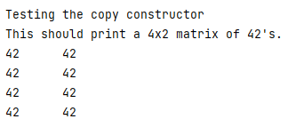

> **Late Days:** I am using 0 late days

# Assignment 11:  Introduction to Overloaded Operators and Function Testing

Original assignment written by Ashley Erickson.  
(C) 2021 Ashley Erickson

>**IMPORTANT!**
> Be sure to read and follow these instructions very carefully!
> These instructions contain hints and useful, required information needed
> to successfully complete the assignment!

**Why this Assignment Matters:**

Believe it or not, some software and engineering roles are completely focused on testing other people's programs.
Have you heard of "Test" engineers or "Test" programmers before? For example, some engineers and programmers are 
hired to actually write testing programs such as
the Basic_Matrix_Driver.cpp file in this assignment in order to help 
debug and test programs.  Being able to code is very important, but it's equally important to test your code
to make sure it is running properly.  As you might imagine, testing large and complex programs is not a trivial 
task. 

The purpose of this assignment is to help you practice using overloaded operators
and use of a driver to test your functions. You are provided with a matrix-like class 
named "`MatrixT`" and a driver program
to test your functions.  Your task is to apply
what we've learned about overloaded operators in order to successfully implement
overloaded operators which perform matrix operations such as addition, subtraction,
and multiplication.  You will also implement the overloaded = and == operators.

You will also get to experiment
with a simple driver program and see how these driver programs can help test
and debug functions. These techniques for declaring, defining, and implementing overloaded operators
will be an important tool in future programs you write.  Designing functions that are easy to 
modify, debug and test is a very important skill to develop.

A crucial part of programming is learning to carefully follow instructions
and pay attention to detail!   You will also practice these skills
as **this assignment requires that you follow these instructions
exactly.**

## Your task for this assignment
> 1. Read these instructions carefully to understand what
     each overloaded operator and `MatrixT` member function must do.
> 2. Update the file MatrixT.h with the
     preconditions and postconditions for each `MatrixT` member function and overloaded operator.
> Do not change any other code in MatrixT.h.  Keep the constants set to the values provided.
> 3. Update the file MatrixT.cpp with the definitions for 
     each `MatrixT` member function and overloaded operator.  
     **Pay attention to implementation order as some functions must be implemented 
     before others in order for the autograder to run properly.**
> 4. Verify that your overloaded operators are working properly by running the Basic_Matrix_Testing 
     program provided.  (The Basic_Matrix_Testing program is not graded and can be modified))
> 

16 points will be autograded, with the remaining 4 points given by Prof. Erickson
for writing clear preconditions and postconditions and for following the good coding practices 
listed in the rubric and discussed in class.

**Grading rubric (20 points possible)**

| Points | Requirements |
|----------|----------|
|2|Default constructor ``MatrixT()`` correctly defined in MatrixT.cpp (autograded).
|2|Constructor ``MatrixT(int rowSize, int colSize)`` correctly defined in MatrixT.cpp (autograded).
|1|Get and Set functions for Rows and Columns correctly defined in MatrixT.cpp (autograded).
|1|Get and Set functions for Elements correctly defined in MatrixT.cpp (autograded).
|2|Overloaded ``operator+`` correctly defined in MatrixT.cpp (autograded).
|2|Overloaded ``operator-`` correctly defined in MatrixT.cpp (autograded).
|2|Overloaded ``operator*`` correctly defined in MatrixT.cpp (autograded).
|2|Overloaded ``operator=`` correctly defined in MatrixT.cpp (autograded).
|2|Overloaded ``operator==`` correctly defined in MatrixT.cpp (autograded).
|2|Clear preconditions and postconditions written for all overloaded operators and member functions in MatrixT.h.
|2|Good coding practices followed for all 3 parts, including: self-commenting variable names, one statement per line, no more than 80 characters per line, properly indenting inside braces/loops/if statements, and including descriptive comments explaining changes with each commit and push to GitHub (manually graded).


Note: You are allowed unlimited attempts ahead of the due date.
So, if you do not achieve full
points after your initial submissions, you may resubmit as many times as you want
until you have reached the deadline or achieved the point total you want.

**Late Day Use**

If you decide to use one or more of your three late days on this assignment, make sure that you
indicate how many late days you are using by updating the "I am using 0 Late Days" text in
the readme.


# IMPORTANT NOTICE FOR AUTOGRADING
## Be aware of this Recommended Implementation Order

Some of the autograder's tests depend on multiple functions to be implemented correctly in order 
to pass correctly.  For example, the default constructor test `MatrixT()` 
cannot pass without `GetElement`, `GetRows`, and `GetColumns` also working 
properly. **To ensure the Autograder's test dependencies are met, it is suggested to 
implement the functions in the following order for this assignment:**

1. `MatrixT()`, `GetElement`, `GetRows`, `GetColumns`
2. `SetRows`, `SetColumns`   
3. `MatrixT(int, int)`
4. `SetElement`
5. `MatrixT(const MatrixT &other)`, `operator=`
5. `operator+`, `operator-`
6. `operator*`
7. `operator==`

# The Driver `basic_matrix_driver.cpp` and Testing Your Functions

This is a driver program.  Remember, drivers are programs we write to help us test functions.
This driver program is not graded by the autograder, but provided to help you test the 
overloaded operators and other MatrixT member functions.  You may modify this code.  Note that
it is not graded and purely provided as a tool to help test the functions in this assignment.

Try playing around with it as you implement the functions in this assignment.  
You might find it helpful to modify this driver or even modify your
own driver functions for testing and debugging more complex functions.

**To run the basic matrix driver program and test your functions, select Basic_Matrix_Testing
from the dropdown menu:**


# The MatrixT class header file `MatrixT.h`

The file `MatrixT.h' contains the declaration for the MatrixT class.
You are provided the following declaration in the MatrixT.h starter code.

As can be seen, the MatrixT class contains public member functions
and some private variables to store a number of 
rows and columns.  It also contains a private 2D array named matrix which contains
MAX_ROWS rows and MAX_COLS columns.

Some constants are also declared in MatrixT's header file to specify MAX_ROWS, MAX_COLS, DEFAULT_ROWS and DEFAULT_COLS.
Do not change these constants.

**The only updates you should make to this file are adding preconditions and 
postconditions for the member functions.  Do not change any other code
or constants in MatrixT.h.**


```
#ifndef MATRIXT_H
#define MATRIXT_H

const int DEFAULT_ROWS = 10;
const int DEFAULT_COLS = 10;

const int MAX_ROWS = 50;
const int MAX_COLS = 50;

class MatrixT {
public:
MatrixT();
MatrixT(int rowSize, int colSize);
MatrixT(const MatrixT& other);

    void SetColumns(int newCols);
    void SetRows(int newRows);

    int GetNumRows() const;
    int GetNumCols() const;

    int GetElement(int rowInd, int colInd);
    void SetElement(int value, int rowInd, int colInd);

    // Overloads
    MatrixT operator+(const MatrixT& other);
    MatrixT operator-(const MatrixT& other);
    MatrixT operator*(const MatrixT& other);
    MatrixT& operator=(const MatrixT& other);
    bool operator==(const MatrixT& other);

private:
// Size of the matrix
int numRows;
int numCols;

    int matrix[MAX_ROWS][MAX_COLS]; // Pointer to the matrix data. Dynamically created.
};
```


# Instructions for Overloaded Operators and Member Functions for MatrixT class

## `MatrixT()`
This is our default constructor.

For the purpose of this assignment, we want to set the number of columns and the number of rows to the 
default values, as specified by the constants ``DEFAULT_ROWS`` and  ``DEFAULT_COLS``.
It should also initialize each element in the matrix to 0.

You can test your default constructor by running the Basic_Matrix_Testing driver.
If your default constructor is working properly, you should see the following output for
the default constructor test:


## `MatrixT(int rowSize, int colSize)`
This function is a constructor which should set the number of rows and the number of columns to 
`rowSize` and `colSize` respectively.  It should also initialize each 
element in the matrix to 0.

This constructor should throw "Invalid size" if the row or column size is 
negative or larger than the maximum matrix size.  Note that the maximum
matrix size is given by the constant 

> **HINT:** Notice that the getter and setter functions you'll define are also required to check for valid size.

You can test your constructor by running the Basic_Matrix_Testing driver.
If your constructor is working properly, you should see the following output for
the alternate constructor test:


## `MatrixT(const MatrixT& other)`

This is a copy constructor for the MatrixT class.
Remember how array names are actually pointers which point
to the memory address of the zeroth element?  In order to set one
MatrixT object equal to another MatrixT object named ```other```, we have to be very 
careful.  We don't want to set one MatrixT's array name directly equal to the array name in
```other```because that will cause the two objects to share the same memory address for their arrays.
We therefore must implement a copy constructor to ensure we do not accidentally
make two MatrixT objects share the same array memory addresses when setting their other values equal.

Let's review how the copy constructor should work.  As discussed in class, the copy constructor
accepts the memory address of an object that we want to set our values equal to.  However, the copy 
constructor includes code to ensure that any pointer memory addresses in our object are kept unique
so that no pointers are accidentally made equal and set to point at the same address.  So, let's use
this approach for the copy constructor in MatrixT.

Recall from linear algebra or math class
that two matrices must have the same number of rows and columns
in order for us to set one matrix equal to another.
First, this copy constructor should update numRows to be equal to other's numRows
and numCols to be equal to other's numCols.  We must have the same number of rows
and columns in our array in order for the arrays to be set equal to each other.

Next, we need to set each element in our matrix equal to the corresponding element
in other's matrix. 

Notice that this copy constructor allows us to ensure that we copy the values
stored in the MatrixT object ```other``` without accidentally copying the 
memory address of other's array.  That way, each MatrixT object keeps its own unique memory address
to store its matrix values.

If your copy constructor is working properly, the Basic_Matrix_Testing driver should
show the following output:




## `void SetColumns(int newCols)`
This function should update the private variable ```numCols``` to be equal to ```newCols```.

The function should also throw the text "Invalid size" if the column size is negative or 
larger than the maximum column size (as specified by the constant in MatrixT.h).

## `void SetRows(int newRows)`
This function should update the private variable ```numRows``` to be equal to ```newRows```.

The function should also throw the text "Invalid size" if the row size is negative or
larger than the maximum row size (as specified by the constant in MatrixT.h).

## `int GetNumRows() const`
This function should return the value of ```numRows``` as an int.

## `int GetNumCols() const`
This function should return the value of ```numCols``` as an int.

If the getter and setter functions for rows and columns
are working properly, the Basic_Matrix_Testing driver should
show the following output:


## `int GetElement(int rowInd, int colInd)`

This function should return the value stored in
the MatrixT object's array ```matrix[rowInd][colInd]``` .

This function should throw "Index out of bounds" if the `rowInd, colInd` is 
out of bounds (negative or larger than the current matrix dimensions).

## `void SetElement(int value, int rowInd, int colInd)`

This function should update the value stored in
the MatrixT object's array ```matrix[rowInd][colInd]``` 
and set that element to be equal to ```value``` .

This function should throw "Index out of bounds" if the `rowInd, colInd` is
out of bounds (negative or larger than the current matrix dimensions).


If these getters and setters are working properly, we should see
the following output in the Basic_Matrix_Testing driver.  The times table shown has each element's value set to
row index x column index.


## `MatrixT operator+(const MatrixT& other)`

This overloaded+ operator should return a MatrixT object
with the values of the matrix ```other``` added to the current instance of MatrixT.

As demonstrated in class, this overloaded operator should first declare a 
temporary MatrixT object into which the sum will be stored.  

In order to properly add the array values, both the current instance and `other` should have exactly the
same dimensions in order for the `operator+` to function correctly.  This
function should throw "Dimensions do not match" if the dimensions do
not match.

After verifying that the number of rows and columns match, 
the temporary  MatrixT object should be updated to contain the same number of rows and columns
as the current instance of MatrixT.

Then, the values in `other`'s matrix should be added to the MatrixT object this 
add operator was used on.
This addition should follow standard matrix addition rules.
So, the value stored in `matrix[i][j]` should be added to `matrix[i][j]` of the object this
operator is used on.

Finally, after addition is complete, the overloaded +operator should return 
the MatrixT object containing the sum.


## `MatrixT operator-(const MatrixT& other)`

The overloaded - operator should perform similarly to the overloaded +operator,
except the matrix values in `other` are subtracted from the current instance.
It is recommended that you follow a similar procedure as described for the +operator
when implementing the overloaded - operator.

Note: Both the current instance and `other` should have exactly the
same dimensions in order for the `operator-` to function correctly.  This
function should throw "Dimensions do not match" if the dimensions do
not match.

## `MatrixT operator*(const MatrixT& other)`

The overloaded * operator should perform similarly to the overloaded +operator,
except the matrix values in `other` and the current instance are multiplied.

The current instance column size and the row size of `other` should be equal in
order for the `operator*` to function correctly.  This function should
first check to make sure this condition is met, and if not,
throw "Dimensions do not match" if the dimensions do not match.

After confirming it is possible to multiply the matrices, we should multiply them.
This multiplication should follow standard matrix multiplication rules.

If you do not remember how to do matrix multiplication, there are many 
great references online.  Here is a helpful article:

https://www.mathsisfun.com/algebra/matrix-multiplying.html

There are also many tutorial videos on Youtube.  Check those resources
if you need a refresher on matrix multiplication rules.


**Checking your overloaded operators**

If your overloaded +, - and * operators work properly, you should see the following
outputs in the driver program provided:


## `MatrixT& operator=(const MatrixT& other)`


The overloaded = operator should first use `this` to 
check to make sure the MatrixT object 
isn't being set equal to itself.  If the matrix is being set
equal to itself, then you can use `*this` to return 
the current instance of Matrix.

Otherwise, now that we have confirmed the matrix is not being
set equal to itself, we should set the number of rows and number
of columns of the current instance to be equal to the
number of rows and number of columns of `other`.  Similarly,
the values in the current instance's `matrix[i][j]` must 
be set equal to the values in other's matrix.

Finally, after setting the values equal to other's values,
the current instance of MatrixT should be returned.

You can test your operator= function by running the driver program.
If your overloaded = operator is working properly, you should see an output like below:


## `bool operator==(const MatrixT& other)`

The overloaded == operator should return true 
if the current instance has the same size (same number of rows and columns)
and identical values as the MatrixT object `other`.

Otherwise, if the current instance does not have the same
number of rows and columns and same matrix values as `other`, we should
return false.

If your overloaded == operator is working properly, you should see the 
below message when running the Basic_Matrix_Testing driver:


#Verifying you are finished with this assignment

If your Assignment 11 shows 16/16 in GitHub, then you have
successfully passed all the autograded tests and your code is correct.
**Be sure to review the rubric and make sure that you have completed all
parts of the assignment, including
writing preconditions and postconditions, use of good coding practices and
including your push and commit comments for all parts.**

If you are having trouble, be sure to reach out for help from Prof. Erickson
in order to complete the remaining sections and receive credit
for this assignment.  Remember, you can use the Basic_Matrix_Testing driver 
and even modify it as you see fit in order to test your member functions.

Remember, you are allowed unlimited attempts before the deadline, so
you may edit and resubmit as many times as you need
before the due date.

**Academic Integrity and Copyright Reminder**

Be reminded that programming assignments you submit must be your own
original work.  Copying code off the internet, copying code from others,
or allowing someone else to copy
your code is a violation of the Academic Integrity policy.  Violations will
result in a zero grade on the assignment for all involved.

You may discuss ideas and concepts with classmates but never
share your code with others.  That way, each student writes up
their own solutions independently and there is no risk of copying.
You are expected to take reasonable precautions to avoid sharing
or allowing others to copy your work without your knowledge.

If you or a classmate is having difficulty with this assignment,
you are welcomed and encouraged to ask for help via help hours,
our online Q&A (Slack/Discord)
or email Prof. Erickson.  Campus tutoring resources are also available.
Be reminded that your submission must be your own original work.
Having someone else "walk you through" the assignment or copying
someone else's work is prohibited per academic integrity rules.

Be aware that Prof. Erickson holds the copyright to this assignment.
Posting this assignment online without prior written authorization from
Prof. Erickson is prohibited and may be considered an academic integrity
violation. 


